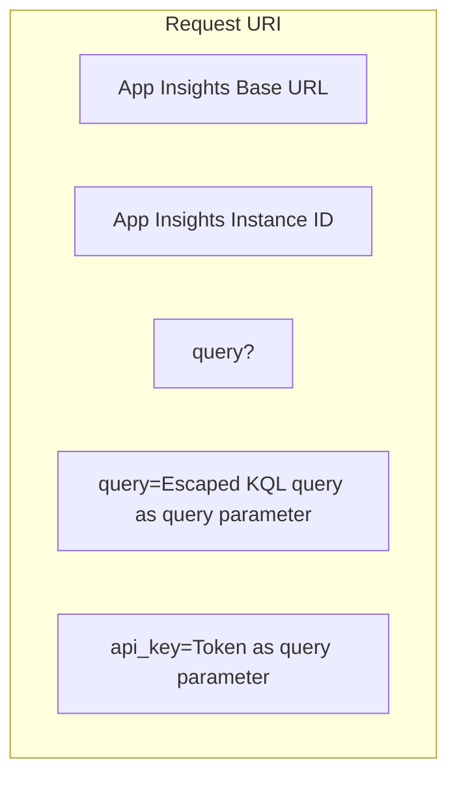
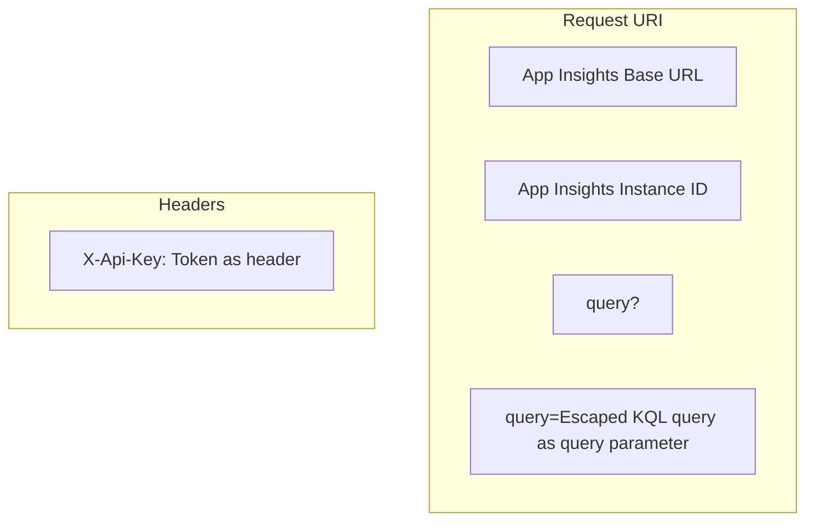

# Exmaple program that Pushes metrics, logs and traces to Applicaton Insights via Open Telemetry

MOnitor configuration and sample directory

## Setup

These steps will create an API key in your applicaton instance and generate a config file with the needed key/value pairs

1. Copy `instance_config.ini.template` to `instance_config.ini` and put in the values from your Application Insights instance
    1. Get the values from the Azure Portal
1. Run `generate_config.sh` to generate an `api_config.ini` file
    1. This will attempt to install the azure cli
    1. This creates an api key with the key name specified in `instance_config.sh`.
    1. This can only be run once because the key by that name will already exist for the 2nd run

## Demo

Retreive custom metrics using the configs created in above. There are a couple queries in the shell script.

1. Run `query_custom_metrics` to retrieve the last 10 customMetrics
    1. This depends on
        1. Values you **manually** inserted in `instance_config.ini`
        1. App Instance specific values that were script generated into `app_config.ini`

## Sample Data

### A Query

This query requires credentials.  I added a `X-Api-Key` header with an access token to my requests. It coul have also been added as a query parameter.

`https://api.applicationinsights.io/v1/apps/<app-id>/query?query=customMetrics+%7C+where+name+%3D%3D+"ST+Ping+Time"+%7C+where+timestamp+>+ago(4h)+%7C+summarize+min(value)%2C+avg(value)%2C+max(value)+by+cloud_RoleInstance
Query: customMetrics+%7C+where+name+%3D%3D+"ST+Ping+Time"+%7C+where+timestamp+>+ago(4h)+%7C+summarize+min(value)%2C+avg(value)%2C+max(value)+by+cloud_RoleInstance`

The URL is constructed either of two ways, when using an `api key`.  `OAuth` is the preferred method for credentials.



or



### Sample M5Flow/UiFlow App

The [Sample AppInsights Python App built with UiFlow / M5Flow](Sample-AppInsightsUiFlow.m5f)runs a specific query against specified Applicaton Insights instances.

### Query Results

Our query only has a single table.  The table contains column metadata and rows of data. You can find a similar result in [SampleQueryResults.json](SampleQueryResults.json)

```json
{"tables":
    [
    {
        "columns": [
            {"name": "cloud_RoleInstance", "type": "string"},
            {"name": "min_value", "type": "real"},
            {"name": "avg_value", "type": "real"},
            {"name": "max_value", "type": "real"}
        ],
        "rows": [
            ["pi-18d8aec7", 54.139, 519.889, 1386.002],
            ["pi-153a3987b", 4.95, 6.448292, 8.023]
            ],
        "name": "PrimaryResult"
    }
    ]
}
```

### Column Section of a Table

The column metadata section describes the columns.

```json
[
    {"name": "cloud_RoleInstance", "type": "string"},
    {"name": "min_value", "type": "real"},
    {"name": "avg_value", "type": "real"},
    {"name": "max_value", "type": "real"}
]
```

### Row Data Section of a Table

The row section contains the actual query results.

```json
[
    ["pi-18d8aec7", 54.139, 519.889, 1386.002],
    ["pi-153a3987b", 4.95, 6.448292, 8.023]
]
```

Our query returned the data for two devices, on different networks in this case

```json
["pi-18d8aec7", 54.139, 519.889, 1386.002]
```

```json
["pi-153a3987b", 4.95, 6.448292, 8.023]
```

## References

### Application Insights

* Azure App Insights docs
  * <https://docs.microsoft.com/en-us/azure/azure-monitor/app/create-workspace-resource>
  * <https://docs.microsoft.com/en-us/azure/azure-monitor/app/create-new-resource>
* Azure Dashboard
  * <https://portal.azure.com/#blade/HubsExtension/BrowseResource/resourceType/microsoft.insights%2Fcomponents>

### Application Insights and OpenTelemetry

* Open Telemetry
  * <https://learn.microsoft.com/en-us/azure/azure-monitor/app/opentelemetry-python-opencensus-migrate?tabs=aspnetcore>
  * <https://learn.microsoft.com/en-us/azure/azure-monitor/app/opentelemetry-add-modify>
  * <https://learn.microsoft.com/en-us/azure/azure-monitor/app/opentelemetry-configuration>

### Application Insights and OpenCensus

* App Insights Open Census Python exporter
  * <https://docs.microsoft.com/en-us/azure/azure-monitor/app/opencensus-python>
  * <https://github.com/census-instrumentation/opencensus-python/tree/master/contrib/opencensus-ext-azure>
  * <https://github.com/census-instrumentation/opencensus-python/blob/master/contrib/opencensus-ext-azure/opencensus/ext/azure/common/utils.py>

### OpenTelemetry

* <https://opentelemetry-python.readthedocs.io/en/latest/sdk/environment_variables.html>

### Applicaton Insights REST API

* <https://learn.microsoft.com/en-us/azure/azure-monitor/logs/api/overview>
* <https://learn.microsoft.com/en-us/rest/api/application-insights/query/get?tabs=HTTP>

### Kusto Query language

* <https://learn.microsoft.com/en-us/azure/azure-monitor/logs/basic-logs-query?tabs=portal-1>
* <https://learn.microsoft.com/en-us/azure/data-explorer/kusto/query/samples?pivots=azuremonitor>
* <https://ds.squaredup.com/blog/aggregating-and-visualizing-data-with-kusto/>

### Python Versioning

* Versioning follows the style here <https://stackoverflow.com/questions/72357031/set-version-of-module-from-a-file-when-configuring-setuptools-using-setup>
