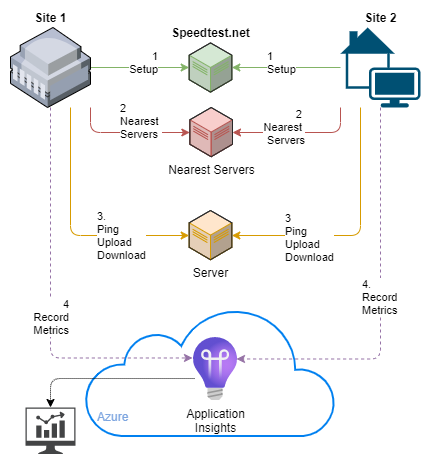

# Digging into App Insights

This document describes how to use App Insights with data generated by OpenTelemetry.

** Sections of this document have not yet been updated for the move from OpenCensus to OpenTelemetry.

## Open Telemetry (OT) vs Open Census (OC)

You can determine which metrics library and version of this code was used by looking at the `sdkVersion` in the event logs.

* Open Telemetry was used if the `sdkVersion` includes `otel` or `ot`. Ex: `py3.9.13:otel1.23.0:ext1.0.0b22`
* OpenCensus was used if the `sdkVersion` value includes `oc`.  Ex: `py3.9.2:oc0.11.0:ext1.1.7`

## Tracking Performance

You can send data from any number of locations to the same Application Insights Instance and then metrics dashboards that compare locations and providers



## Azure Appication Insights

Python observability information can be sent to Azure Application Insights as `Metrics`, `Traces` or, `Logs`.
Each data point is actualy sent as an event/log-message which means that it can be displayed in _Metrics_ as an _Aggregation_ and in _Logs_ as an individual event.

This program demonstrates the three different types of telemetry supported for Python Applications.

| Azure Monitor telemetry | Application Insights Table | Open Census Terms | Event information                                    |
| ----------------------- | -------------------------- | ----------------- | ---------------------------------------------------- |
| _trace exporter_        | `dependencies`             | trace and span    | Nested tracing spans  in msec                        |
| _metrics exporter_      | `customMetrics`            | metrics           | Counters or Values. values returned by SpeedTest API |
| _log exporter_          | `traces`                   | Python logger     | logging output when --verbose is set                 |

## Metrics Dimensions

The OpenCensus Exporters send various standard or custom dimensions as part of each event.

### Standard Dimensions provided by _all_ exporters

_as of 3/2021_
The [azure exporter utils.py](https://github.com/census-instrumentation/opencensus-python/blob/master/contrib/opencensus-ext-azure/opencensus/ext/azure/common/utils.py) sends a fixed set of properties to Application Insights that can be used in charts for **filtering** or **splitting**

| Property Name               | Populated With        | Probably Source                       |
| --------------------------- | --------------------- | ------------------------------------- |
| Application Version         | `undefined`           | n/a                                   |
| Authenticated User          | `False`               | n/a                                   |
| Browser Version             | `Python Requests n.n` | ?                                     |
| City                        | location              | ?                                     |
| Cloud Role Instance         | **hostname**          | platform.node()                       |
| Cloud Role Name             | Python script name    | sys.argv[0]                           |
| Country or Region           | country               | ?                                     |
| Device Model                | `other`               | hard coded device.type                |
| Device Type                 | `PC`                  | ?                                     |
| Operating System            | `#1333 SMP ...`       | platform.version() part of `uname -a` |
| Operation Name              | `undefined`           | n/a                                   |
| Real or synthetic traffic   | `False`               | ?                                     |
| Source of synthetic traffic | `undefined`           | n/a                                   |
| State or Province           | State                 | ?                                     |

1. Splitting is not supported on charts with multiple metrics. [See documentation](https://docs.microsoft.com/en-us/azure/azure-monitor/essentials/metrics-charts)
1. You can break out each metric by host by **splitting** using the `Cloud Role Instance` dimension

### Custom Dimensions provided by the _Metrics_ exporter

AppInsights.py adds two `customDimension` properties.  You can see the `customDimension` subtree inside each custom metric

| Custom Dimension | Value                                              |
| ---------------- | -------------------------------------------------- |
| client_isp       | client isp as reported by speedtest sdk            |
| server_host      | speedtest server host as reported by speedtest sdk |

Notes:

* CustomDimensions can be seen on the query screen results pane as a combined json structure.
* CustomDimensions are use case specific and must be explicitly to the results configuratio.
* CustomDimensions can be used to filter in gauges.

## Structure in the OpenCensus API and Application Insights metrics exporter

This is _partially correct_ explanation of OpenCensus events and Azure bindings

1. The `measure` is a type definition that is used as a key to register both `metrics` and `views`
    1. The view list has `views` keyed by `measure`
    1. The events have `recordings` keyed by `measure`

## Creating Graph Panes from Metrics

Metrics aggregations are visible as `metrics` in the Applicaton Insights under _Monitoring / Metric.

1. `Home > Application Insights > _your resource_`
2. Left side-bar `Monitoring / Metrics`
3. Query with something like

    ```txt
    Scope -> Your App Insights name
    Metric Name Space --> Log-based metrics
    Metric --> one of the speedtest ST metrics like "ST Ping time"
    Aggregation --> min / max / average?
    ```

4. If you have more than one device and want to see them slit out on the graph pane then add a split by `Cloud role instance`

### Populating Dashboards with Graph Panes

Graph panes can be added to dashboards.  Dashboards are sort of global and work across App Insights instances across subscriptions.

1. Add the graph pane created above to a `Dashboard`.  You can add add a graph pane to an existing `Dashboard` or create a new one

Dashboards have a different scope than App Insights or other resoruces.  You can see this when you look at their URL which is different from the rest of the Azure Portal.
> `https://portal.azure.com/#@<Azure AD Domain-Tenant>/dashboard/private`

## _Metrics_ in Application Insight

Individual _Metrics Events_ can also be seen under _Monitoring / Logs_

1. `Home > Application Insights > _your resource_`
1. Left side-bar `Monitoring / Logs`
1. Run a query for `customMetrics`


[App Insights CustomMetrics Blog Article](https://joe.blog.freemansoft.com/2021/03/querying-python-metrics-custom-tags-as.html)

Metrics currently created in this package:
| Metric Namespace    | SpeedTest Metric       | Description                                       |
| ------------------- | ---------------------- | ------------------------------------------------- |
| `Log Based Metrics` | `ST Ping Time`         | ping time as reported by SpeedTest                |
| `Log Based Metrics` | `ST Download Rate`     | download speed as reported by SpeedTest           |
| `Log Based Metrics` | `ST Upload Rate`       | upload speed time as reported by SpeedTest        |
| `Log Based Metrics` | `ST Servers Time`      | initial SpeedTest setup call time                 |
| `Log Based metrics` | `ST Best Servers Time` | time it took to get 'best servers' from SpeedTest |
| `Log Based metrics` | `ST DNS Min`           | DNS Ping Time  metric                             |
| `Log Based metrics` | `ST DNS StdDev`        | DNS Ping Time metric                              |
| `Log Based metrics` | `ST DNS Avg`           | DNS Ping Time metric                              |
| `Log Based metrics` | `ST DNS Max`           | DNS PIng Time metric                              |

### Sample metrics queries

```ksql
customMetrics | where cloud_RoleInstance == "Powerspec-g708"
customMetrics  | where name == "ST Upload Rate" or name == "ST Download Rate"

```

## _log_ messages in Application Insight

The program can send a single line of output per run to the ApplicationInsights as `traces` in the Log export query screens
Individual _log statements_ can be seen under _Monitoring / Logs_

1. `Home > Application Insights > _your resource_`
1. Left side-bar `Monitoring / Logs`
1. Run a query for `traces`


[App Insights - Logging as Traces Blog Article](https://joe.blog.freemansoft.com/2021/03/querying-python-logs-azure-application.html)

## _Tracing and Spans_ in Application Insight

The program sends trace exports via the OpenCensus `Trace and Span` APIs.

Individual _traces_ can also be seen under _Monitoring / Logs_

1. `Home > Application Insights > _your resource_`
1. Left side-bar `Monitoring / Logs`
1. Run a query for `dependencies`

You can use the _Performance_ dashboard to see span timing information.

* Click on _Performance_ on the left.
* Open the list of traces/sample by clicking on _Samples_ in the bottom right corner
* Drill down into an individual call chain by double clicking on a transaction in the list on the right


* Other resources

[App Insights - Transactions Spans with Open Census Blog Article](https://joe.blog.freemansoft.com/2022/11/querying-python-transactions-and-spans.html)
_________________________________________________

## Sample Queries against the Logs

Some samples derived from <https://social.msdn.microsoft.com/Forums/azure/en-US/7333f142-fe43-4efd-a6e4-e61f9078c145/azure-app-insights-join?forum=ApplicationInsights>

All of the traces for some time window

```txt
dependencies
```

Length of time each test took including number of spans created in that test

```txt
// the number of buckets for each operation id and how long the outside span took
dependencies
| summarize max=max(duration) , NumSpans=count() by operation_Id
```

Performance statistics for running the entire test comparing the performance with upload/download vs not

```txt
// Metrics for when we do downloads and when we don't
// 1. for each span Id find the longest which is actually the outer span
// 2. for each pool 3/5 and role instance
// this assumes that we run no up/down or both up/down  It is broken if sometimes up and sometimes down
dependencies
| summarize OuterSpanTime=max(duration) , NumSpans=count() by operation_Id, cloud_RoleInstance
| summarize average_OuterSpanTime = avg(OuterSpanTime), percentiles(OuterSpanTime, 0, 50,95,99) by cloud_RoleInstance, NumSpans
```

Query taken from dashboard that provides stats on each individual span type

```txt
// this query calculates dependency duration percentiles and count by target
let start=datetime("2021-03-15T01:18:00.000Z");
let end=datetime("2021-03-16T01:18:00.000Z");
let timeGrain=5m;
let dataset=dependencies
    // additional filters can be applied here
    | where timestamp > start and timestamp < end
    | where client_Type != "Browser"
;
dataset
// change 'target' on the below line to segment by a different property
| summarize count_=sum(itemCount), avg(duration), percentiles(duration, 50, 95, 99) by target
// calculate duration percentiles and count for all dependencies (overall)
| union(dataset
    | summarize count_=sum(itemCount), avg(duration), percentiles(duration, 50, 95, 99)
    | extend operation_Name="Overall")
| order by count_ desc
```
