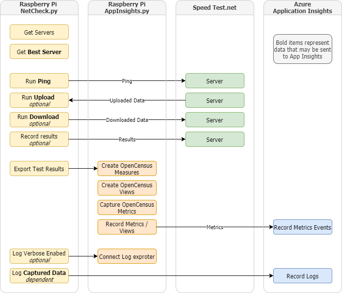
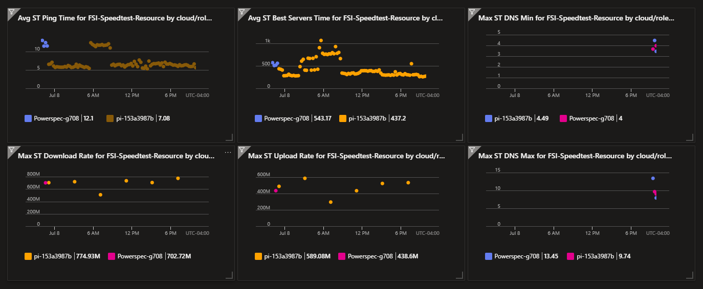

# Purpose
This project captures internet connection statistics and sends them to an Azure dashboard.



1. Capture the current ping time and optionally upload/doownload statistics of the internet connection for the machine this machine runs on as measured by the `speedtest.net` python API 
1. Publish the results to an Azure Application Insights dashboard
 


# Prerequisites
1. Python3
1. An internet connection
1. An account in Azure that can run the free tier of _Azure Application Insights_.  See references below for instructions.
    1. You can comment out the AppInsights.py call at the bottom of NetCheck.py if you don't wish to create a dashboard in _Azure Application Insights_

# Scripts in this repository
| Script | Purpose |
| - | - |
| 0-setup.sh | downloads the Speedtest.net CLI, configures Python |
| 1-install-crontab.sh | Installs a crontab entry that runs NetCheck.py on a regular basis |
| 3-remove-crontab.sh | removes this user's NetCheck.py crontab entries | 
| | |
| NetCheck.py | Program that invokes the test code in SpeedTest.py |
| SpeedTest.py | runs the speedtest-cli and records metrics |
| AppInsights.py | OpenCensus library wrapper used to send metrics to Azure Application Insights | 
| setup.ps1 | Windows setup program. Will prompt to install python3 via Windows store |

# Usage - NetCheck and Azure App Insights
1. Run `0-setup.sh` to install dependencies
1. Get an Azure account and log in
    1. Register in Application Insights to get an Application Insights key
    1. Copy config.ini.template to config.ini
    1. Replace the dummy key in config.ini with yoru new key
1. Run `NetCheck.py`
  1. Run with only a ping check `python3 NetCheck.py `
  1. Run with ping, upload and download `python3 NetCheck.py --download --upload`
  1. Get help with `NetCheck.py --help`

**Optional**
1. Manage data retention  [the data retention period](https://docs.microsoft.com/en-us/azure/azure-monitor/app/pricing#change-the-data-retention-period). Learn [how long data is kept](https://docs.microsoft.com/en-us/azure/azure-monitor/app/data-retention-privacy).  
    
## Installing in crontab to run repeately
1. cd into this directory
1. Verify the cycle times you wish in `1-install-crontab.sh`.  The file is in crontab format.
1. run `1-install-crontab.sh`

# Example speedtest.net cli output
Raspberry Pi3 on 1GB port on 1GB FIOS internet service.

## speedtest installed as part of apt package
Installed in /usr/bin
```
pi@pi-52863f1:~/Documents/speedtest-app-insights $  /usr/bin/speedtest

   Speedtest by Ookla

     Server: Windstream - Ashburn, VA (id = 17383)
        ISP: Verizon Fios
    Latency:     4.04 ms   (0.04 ms jitter)
   Download:    94.19 Mbps (data used: 42.4 MB)                               
     Upload:    93.90 Mbps (data used: 42.3 MB)                               
Packet Loss:     0.0%
 Result URL: https://www.speedtest.net/result/c/dee19d27-1f5a-4cff-aa42-d8084a145b8f
```

## speedtest installed as part of speedtest-cli github pull
Installed in ~/.local/bin
```
$ speedtest
Retrieving speedtest.net configuration...
Testing from Verizon Fios (108.48.69.33)...
Retrieving speedtest.net server list...
Selecting best server based on ping...
Hosted by PBW Communications, LLC (Herndon, VA) [22.70 km]: 8.306 ms
Testing download speed................................................................................
Download: 91.92 Mbit/s
Testing upload speed......................................................................................................
Upload: 93.90 Mbit/s
```

# Application Insights
See [Application Insights Readme](READ-APP-INSIGHTS.md)

# Raspberry Pi Networking
Some Raspberry Pi models are speed limited on their ethernet. magpi posted ethernet test results https://magpi.raspberrypi.org/articles/raspberry-pi-4-specs-benchmarks

* In my testing, the Raspberry Pi 3 hardwire Ethernet seems to max out about 94 Mbit/s. The Raspberry Pi speed should be sigficantly higher because its eithernet interface is part of the SoC instead of being USB attached like previous boards.
* My results align with numbers in this blog article https://www.jeffgeerling.com/blogs/jeff-geerling/getting-gigabit-networking . The same article says you can get slightly over 200 Mbit/s with a USB 3.0 Gigabit adapter.  
* This site shows Raspberry Pi 3 and Pi 4 speeds. Note that the Pi3 speeds on this page are higher than other reference sites https://hackaday.com/2019/07/10/raspberry-pi-4-benchmarks-processor-and-network-performance-makes-it-a-real-desktop-contender/ 

# References
* Speedtest Python library
    * https://github.com/sivel/speedtest-cli
* Azure App Insights docs
    * https://docs.microsoft.com/en-us/azure/azure-monitor/app/opencensus-python
    * https://docs.microsoft.com/en-us/azure/azure-monitor/app/create-new-resource
* App Insights Open Census Python exporter
    * https://github.com/census-instrumentation/opencensus-python/tree/master/contrib/opencensus-ext-azure
    * https://github.com/census-instrumentation/opencensus-python/blob/master/contrib/opencensus-ext-azure/opencensus/ext/azure/common/utils.py
* Azure Dashboard
    * https://portal.azure.com/#blade/HubsExtension/BrowseResource/resourceType/microsoft.insights%2Fcomponents

# Release Notes

The speed test team changes something in their API in April 2021. 
This changed some format that broke speedtest.py.  You need either the 2.1.3 version of the speedtest.  Grab it with pip3 or if not available then the following assuming you run pip not as root

```
wget https://raw.githubusercontent.com/sivel/speedtest-cli/v2.1.3/speedtest.py -O ~/.local/lib/python3.<version>/site-packages/speedtest.py 
```
Ex:
```
wget https://raw.githubusercontent.com/sivel/speedtest-cli/v2.1.3/speedtest.py -O ~/.local/lib/python3.7/site-packages/speedtest.py 
```
